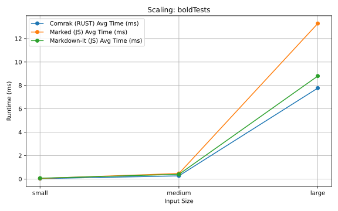
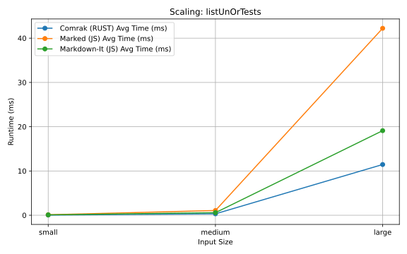
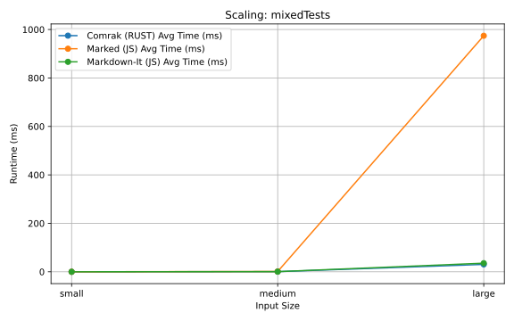
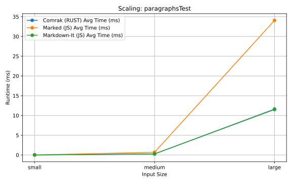

# Markdown Parser Performance Benchmark — RUST vs JavaScript
Version: <b>1.0</b> (_Maybe I'll make this look nicer someday_)<br>
Author: <b>Timan Zheng</b><br>
Date: <b>8/15/2025</b><br>
(Short) Description: <b>This is an incredibly — and intentionally — primitive single-webpage site (in base HTML) set up in order to compare the parsing speeds of a Rust-powered Markdown parser (Comrak) vs two popular JavaScript parsers (Marked & Markdown-It) for real-world editing workloads.</b>

## Overview & Motivation
This project benchmarks a <b>RUST</b>-powered Markdown parser (<b>Comrak</b>, compiled to WebASsembly) against two widely-used <b>JavaScript</b> parsers (<b>Markdown-It</b> and <b>Marked</b>) to evaluate perofrmance across a variety of Markdown content types and sizes.

Markdown parsing can be CPU-intensive particularly as documents get larger and larger (_and in a real world setting, you would often expect that they do_). The goal of this project is more or less personal research — to determine if integrating a RUST-powered parser into my existing full-stack Collaborative Markdown Editor personal project would be worthwhile (bringing tangible performance benefits for larger documents and so on). 

Comrak, the RUST-powered parser of my choice, compiles to WASM which — as is generally stated — can be significantly faster than JavaScript given certain cases (and typically is in general). And so, this project exists essentially so that I can confirm this statement for my own eyes — and to further justify my integration of a RUST-powered parser into my existing Collaborative Markdown Editor project (which currently relies on Markdown-It).

## The Actual Site (GUI to Initiate Benchmark Testing)
1. To set this up, just navigate to the root director and run `npx serve .` — that's it. (`wasm-pack build --target web` and all of that should have already been ran, so wouldn't be necessary to do it again).
2. <b>You're going to see two boxes</b>: one (LHS) is an input box for typing in markdown content; the other (RHS) is the render box for which markdown is rendered and displayed.
3. Underneath the LHS box are two buttons, one for rendering the markdown that the user manually types themselves — the other for <b>running the benchmark tests</b>.

<b>BE WARNED:</b> Running the benchmark tests will take quite a long time (~10 minutes, even exceeding that). The reason for this is intentional, you will find more information about this in the Testing Methodology section of the README...

<b>NOTE:</b> I put as little effort into the GUI style-wise as I possibly could. That is not the purpose of this project. As stated earlier, this is basically just research for me. (_And also, I have a terrible habit of getting far too into the weeds of unnecessarily customizing frontend stuff and wasting time_).

## Benchmark Testing Setup
### Test Categories:
- Isolated formatting types (headings, bold, italics, code blocks, tables, lists) and mixed/nested formatting. 
- This is fairly straightforward, I also included an "Image" category for rendering Cloudinary links (_and this is a unique case specific to my Collaborative Markdown Editor project_).
- There is also a sample `.md` document tested as well.
### Input Sizes:
- **Small** ≈ ~1KB (e.g., single short paragraph or heading)
- **Medium** ≈ ~100KB (repeated Small content ~100×)
- **Large** ≈ ~1MB+ (repeated Small content ~5000×)
### Methodology:
- 100 runs per parser test case.
- Average parsing time measured in miliseconds using JavaScript's `performance.now()`. 
- Equal parser configuration with unnecessary features disabled:
```
marked.use({mangle: false, headerIds: false});
...
const mdParser = new MarkdownIt({html: false, linkify: false, typographer: false});
```
- Parsers run in the same order for consistency.
```
Comrak -> marked -> markdown-it
```
- WASM warm-up run for Comrak before each test to avoid first-call overhead.

## Methodology Expanded

I test each category of markdown formatting (bold, italics, headers, lists, and so on) in their isolated unit tests varying sizes (small, medium, and large). The idea that we can have like single-line markdown (e.g., smallHeadingV1 = "# Small Heading") would be equivalent to a small .md file of ~1kb or however much, then a markdown that's repeated for ~100 lines might be equivalent to a medium sized ~100kb file. Lastly, perhaps a little extreme, there would be a markdown repeated for ~5000 lines could constitute a large ~>1mb file.

Instead of running and timing each Unit Test once, I decided to run 100 iterations of each test and then average out the time it takes for each parser to parse the Markdown (timed in miliseconds). Of course, the aim in doing this is to reduce as much statistical bias and "noise" in the results as possible. Granted, I must admit that I take this logic to an extreme as I *still* do this for "large"-sized unit tests where I parse input that is 5000 lines in length. <b>This causes the benchmark testing to be quite long (~10 minutes)</b> but I maintain this principle to uphold statistical integrity (compensate for any potential jitters with `performance.now()` or whatever. This project exists for research and discerning data).

My event listener for the "benchmarksBtn" button is the single-go benchmark runner (that'll loop through all the test cases, run all three markdown parsers and record the average time over 100 runs per test, including the large-sized ones).

### Other Measures Taken

This is neglible, but when doing `const htmlOutput = parse_markdown(mdInput);` it adds an extremely tiny amount of overhead to the runtime and to compensate for that, I assigned and discarded the JavaScript parser results with the `_` character:
```
let _ = marked(mdInput);
let _ = mdParser.render(mdInput);
```

I run an initial test of the Comrak parser prior to every unit test to make up for potential WASM warm-up:
```
// Warm-up run (JIT & WASM initialization).
runParsers(mdText);
```

## Performance Summary
Benchmarks show that **Comrak scales more consistently** than both JavaScript parsers:

* **Comrak (Rust/WASM)** — Near-linear growth in parse time as input size increases.
* **Markdown-It** — Slightly steeper growth but competitive; often within 10–30% of Comrak’s times.
* **Marked** — Erratic spikes on certain patterns *probably* due to regex backtracking; sometimes 50× slower than Comrak.

### Extreme Test Cases Examples (Large Inputs):

| Test Case       | Comrak   | Marked     | Markdown-It |
| --------------- | -------- | ---------- | ----------- |
| largeMixed      | 30.57 ms | 974.11 ms  | 35.55 ms    |
| largeEsc        | 7.81 ms  | 3719.53 ms | 12.04 ms    |
| largeParagraphs | 11.53 ms | 34.07 ms   | 11.63 ms    |

### Visualizations of Test Cases
Here are some Line Chart plottings of the three Parsers' performances for rendering these test cases (across Small, Medium, and Large input sizes): bold, list (unordered), mixed case, and paragraphs...

Data used to generate these charts were taken from [**Test Results #1**](./documentation/TestResults1.md). For more information, see [**explanation.md**](./docUtility/explanation.md)

1. **bold**:

2. **list (unordered)**:

3. **mixed case**:

4. **paragraphs**:


These Line Charts are simply rough plottings to demonstrate the general trend of scaling behavior and to illustrate that it clearly favors Comrak. Of course, these are **not** rigorous proofs nor formal complexity analysis, just observational takeaways from my testing. (Yes, markdown-it is quite competitive, however, if you look at the values in the Test Result, you will see that Comrak is typically faster. The difference is often a matter of miliseconds so it is neglible to human eyes, however **clearly the difference becomes noticeable with certain larger inputs**).

### In Summary - Growth Patterns:
- **Comrak:** Consistently linear with input size.
- **Markdown-It:** Slightly higher slope.
- **Marked:** Unpredictable spikes, often catastrophic for certain content types.

### In Summary - Average Test Runtimes:
| Test Run | Comrak (RUST) Avg Runtime | Marked (JS) Avg Runtime | Markdown-It (JS) Avg Runtime |
|----------|---------------------------|-------------------------|------------------------------|
| #1       | 2.79 ms                    | 121.77 ms               | 4.56 ms                      |
| #2       | 2.96 ms                    | 122.05 ms               | 4.59 ms                      |
| #3       | 3.26 ms                    | 124.29 ms               | 5.24 ms                      |

**Observation:** Across all three runs, Comrak consistently delivers **~40x–50x faster performance** than Marked for large or complex markdown inputs, while also edging out Markdown-It in most cases. Marked’s runtimes show occasional extreme spikes on certain tests (notably large inline code, links, and escape sequences), suggesting less predictable scaling for very large markdown content.

## Where Marked Yields Catastrophic Results
Marked uses a regex engine unlike Comrak and Markdown-It which are Tokenizing parsers.

### Large Escaped Text (`largeEsc`)
- Pattern: `\*not italics\* \*\*not bold\*\*` × 5000.
- Marked’s regex engine likely fails on escapes → **3.7 seconds** vs Comrak’s **7 ms**.

### Large Mixed (`largeMixed`)
- Nested formatting: bold, italics, strikethrough, inline code — repeated 5000×.
- Regex parsers re-run inline passes, causing combinatorial slowdowns.
- Tokenizing parsers (Comrak, Markdown-It) handle this gracefully.

### Large Inline Code (`largeInlineCode`)
- `const x = 46;` repeated 5000×.
- Marked’s regex for backticks appears unanchored, causing multiple scans per match.

### Large Link (`largeLink`)
- `[Link to Google](https://www.google.com/)` repeated 5000×.
- Regex complexity for nested brackets/parentheses causes long match attempts.

### Large Paragraphs (`largeParagraphs`)
- Huge contiguous text blocks trigger multiple overlapping regex scans in Marked.
- Tokenization-based parsers avoid re-parsing entire blocks.

## **Conclusion**

Comrak delivers:

* **Consistent, near-linear scaling**
* **Better performance** in large document scenarios
* Avoidance of catastrophic slowdowns present in regex-heavy parsers

Markdown-It remains a strong JS option, but Comrak’s speed advantages on large inputs make it a compelling choice for my **Collaborative Markdown Editor**. _So, yeah, I have the green-light to upgrade it now._

## **Acknowledgements**

* [Comrak](https://github.com/kivikakk/comrak)
* [Markdown-It](https://github.com/markdown-it/markdown-it)
* [Marked](https://github.com/markedjs/marked)
* [CommonMark Spec](https://spec.commonmark.org/)
